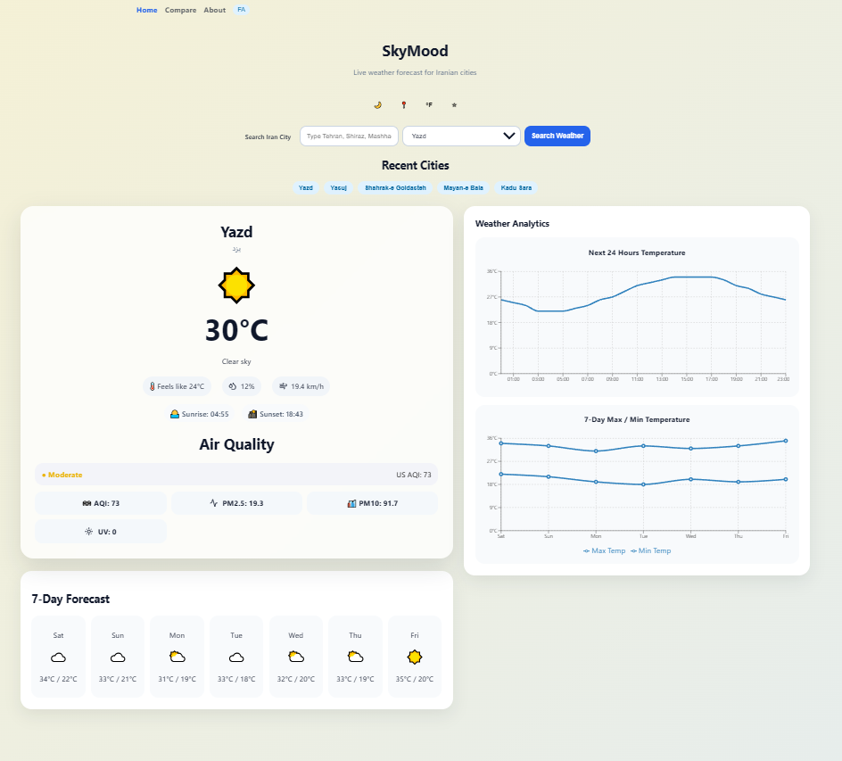
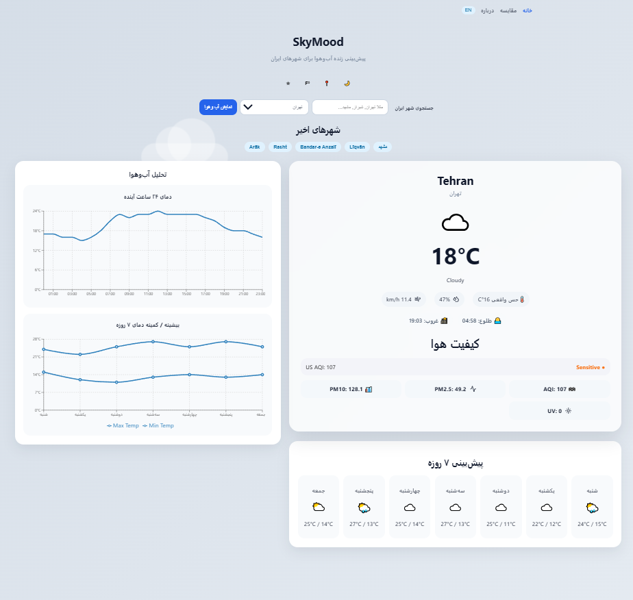
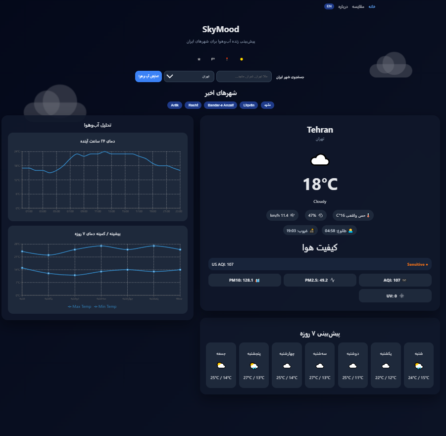
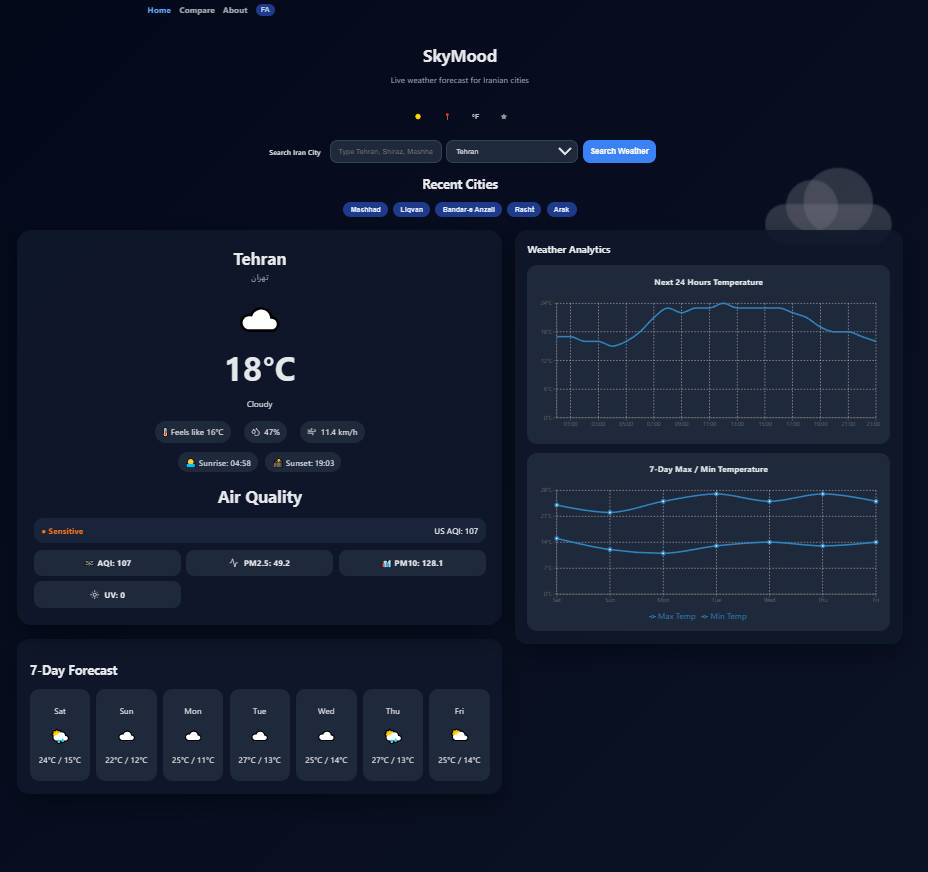
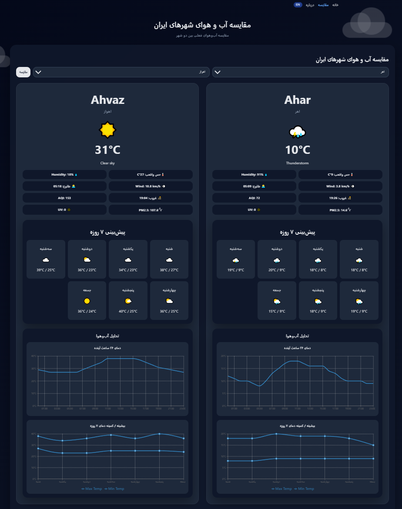
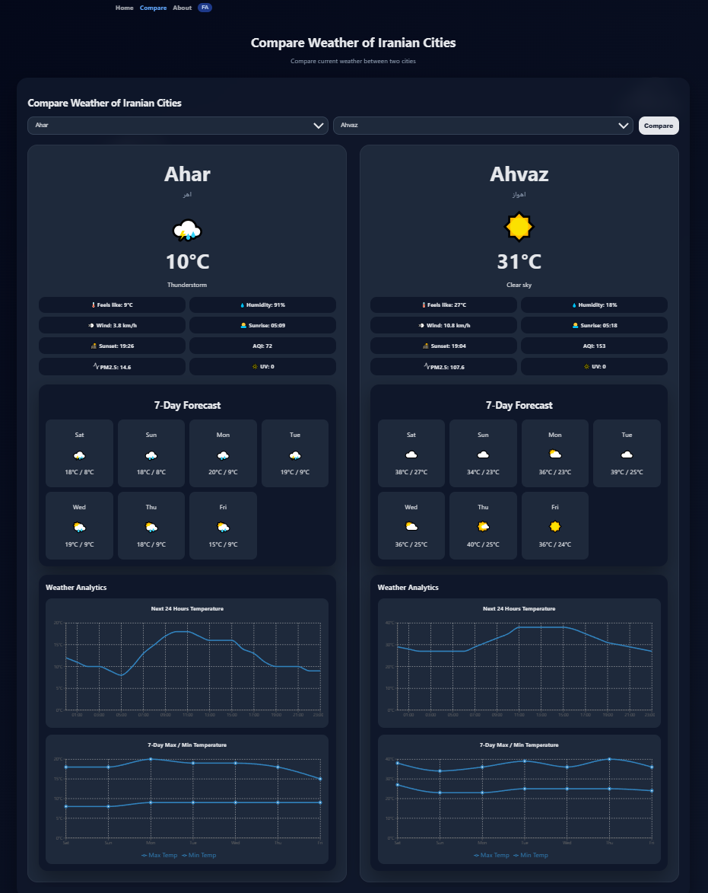
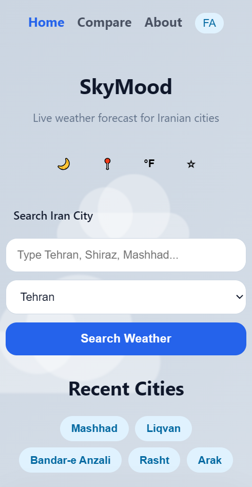
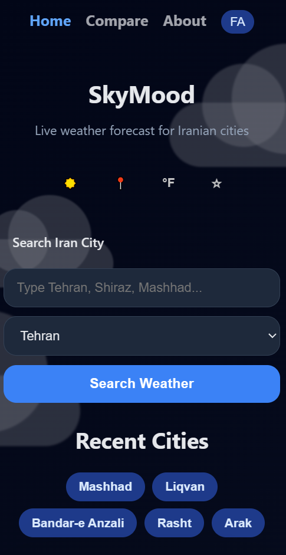

# SkyMood App

A modern Progressive Web App (PWA) and Android-ready weather platform focused on Iranian cities with live forecasts, animated weather backgrounds, air quality analytics, charts, favorites system, multilingual support, and responsive UI.

---

## 🌍 Live Demo

https://ir-skymood.netlify.app/

## ✨ Features

- 🌤️ Real-time and Live weather forecast for Iranian cities
- 📍 Location-based weather
- 🌡️ Celsius / Fahrenheit toggle
- 🌙 Dark / Light mode
- 🇮🇷 Persian / English language support
- 📊 Weather charts with Recharts and 7-day weather forecast
- 📱 Offline-ready PWA support
- 🌧️ Animated weather backgrounds
- ⭐ Favorite cities system
- 🫁 Air quality & UV index
- 🔄 API caching with localStorage
- 📱 Fully responsive design and Responsive mobile UI
- ⚡ Framer Motion animations
- 🔍 City comparison dashboard
- 💾 Recent search history
- 📱 Android APK support with Capacitor
---

## 🛠️ Tech Stack

### Frontend

- React
- Vite
- React Router
- Axios
- Framer Motion
- Recharts
- Capacitor

### APIs

- Open-Meteo Weather API
- Open-Meteo Air Quality API
- Open-Meteo Geocoding API

### Storage

- localStorage

### Styling

- Pure CSS
- Responsive Grid/Flex layouts
- Dynamic weather-based themes

---

## 📸 Screenshots

### Home Page






### Compare Page




### APP/MOBILE Mode






---

## 🚀 Installation

Clone the repository:

```bash
git clone https://github.com/YOUR_USERNAME/Sky-Mood.git
```

Go to project folder:

```bash
cd Sky-Mood
```

Install dependencies:

```bash
npm install
```

Run development server:

```bash
npm run dev
```

Build production version:

```bash
npm run build
```
---

## 📦 Android Build

Install Capacitor:

```bash
npm install @capacitor/core @capacitor/cli @capacitor/android
```

Initialize Capacitor:

```bash
npx cap init
```

Build and sync:

```bash
npm run build
npx cap sync android
```

Open Android Studio:

```bash
npx cap open android
```

Generate APK:

```txt
Build → Build APK(s)
```

---

## 🌐 PWA Support

This application supports:

- Installable web app
- Offline caching
- Mobile home screen install
- Responsive mobile experience

---

## 🌐 APIs Used

### Open-Meteo

- Weather Forecast API
- Air Quality API
- Geocoding API

https://open-meteo.com/

---

## 📂 Project Structure

```txt
src/
 ├── api/
 ├── components/
 ├── i18n/
 ├── pages/
 |     └── data/
 ├── utils/
 ├── App.jsx
 └── main.jsx
```

---

## 🎯 Main Features Implemented

- Dynamic weather mood backgrounds
- Reusable React components
- API response caching
- Responsive dashboard layout
- RTL language support
- Animated transitions
- Persistent favorites with localStorage
- Interactive weather analytics

---

## 📈 Performance Optimizations

- Cached weather requests
- Reduced API calls
- Lazy UI rendering
- Responsive chart rendering
- LocalStorage persistence

## 📊 Lighthouse Scores

Desktop:

- Performance: 100
- Accessibility: 95+
- Best Practices: 96+
- SEO: 100

Mobile:

- Performance: 94+

---

## 🇮🇷 Persian City Dataset

The project includes a custom Iranian cities dataset with:

- English city names
- Persian city names
- Latitude & longitude
- Province information

---

## 🔮 Future Possible Improvements

- Offline mode
- Weather notifications
- Advanced map integration
- Hourly radar animation
- User accounts

---

## 👩‍💻 Author

Amirhosein Bavandpour

Frontend Developer & Enthusiast

---

## 📄 License

MIT License